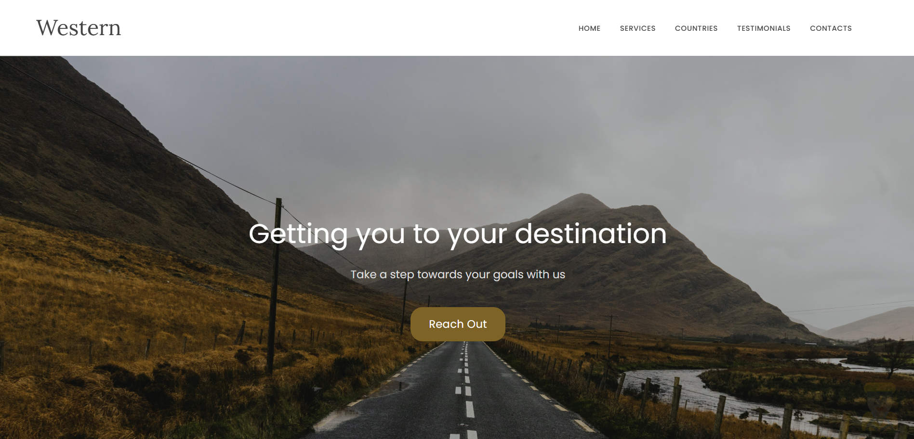
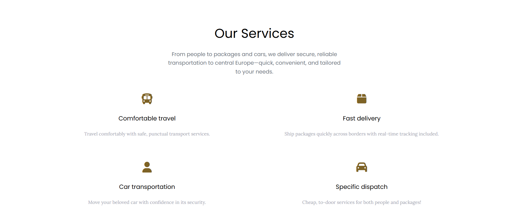
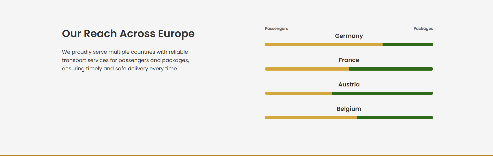
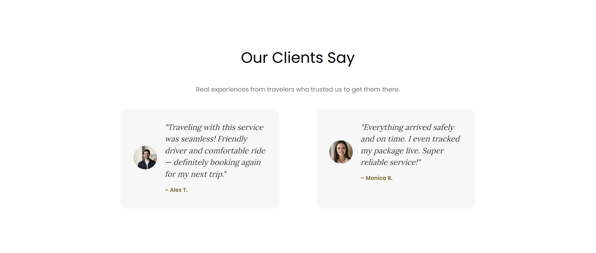
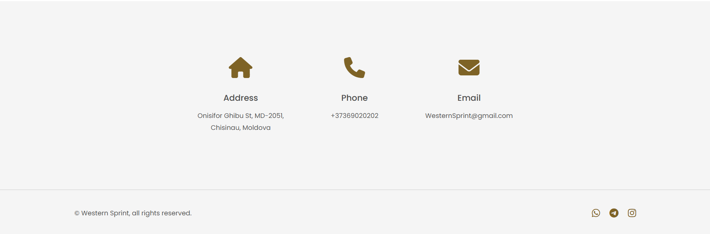
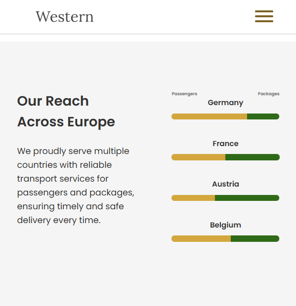
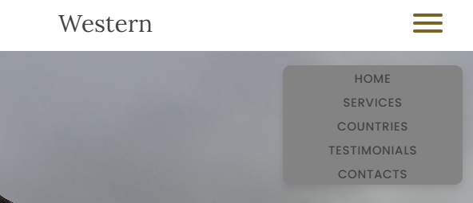
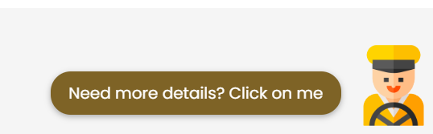

# Lab 2 - Landing page

Create a web page for your/friends/relatives business. I have created a transport business site, specifically related to travel in the centric european countries.

## Customer requirements

- The page has 7 sections with multiple CTAs and a form of page navigation with a hover effect, complete with possible navigation to contact sites.

## Dev requirements

- Only vanilla HTML and CSS are used
- 11 commits.
- The Page was deployed on GitHub pages

# Lab 3 - Responsive Design & Animations

Improve your already amazing landing page

## Customer requirements

  All elements are adjusted for desktop and mobile view, with call to action visible on mobile. It also has a section that is only visible on the phone, a burger menu in the navbar with references to navigate the site.
    

I also added a mascot, a truck driver, which appears after 6 seconds on the right bottom side of the page, and hovers constantly. When hovered, it displays a CTA message.

 
## Dev requirements

- Vanilla CSS and HTML were used
- 7 commits, but I also made some changes to make it flexible during laboratory nr 2.
- The page with mascot and responsive design is live on Github Pages

# Lab 4 - CSS Libraries/Frameworks

The client wants to simplify and streamline the process of styling and designing their landing page. 
So they think adding a CSS library/framework will make the development more rapid and consistent.

## Customer requirements

- **Quote section designed using tailwindcss**
- **Services section designed using tailwindcss**

For both pages, I removed what was made of styling from styling.css and used tailwindcss to design them similar to the previous version.

## POC and requirements
Using Tailwindcss I was able to write less code, both in lines and in letter count, which showcases why this framework makes styling more efficient. Before, it took 11 classes and 100 lines of code(not including the index.html lines) to achieve the same result I achieved in 60 lines using tailwind. This has kept the project more clean, more organized, reducing class naming headaches, and removing media queueries and making responsive mobile designs easier.

  - I have chosen Tailwind CSS
  - I used some layout class helpers like flex, flex-col, flex-wrap, justify-center, items-center, justify-between and other padding and margin.
  - I also used some colors and styles from the CSS framework text-[#7e6326], text-black, text-gray-400, text-gray-500, text-white
  - 7 commits were made and the site is live on github pages.
 
## Live site: 
https://mariuspopa1.github.io/PWEB/

